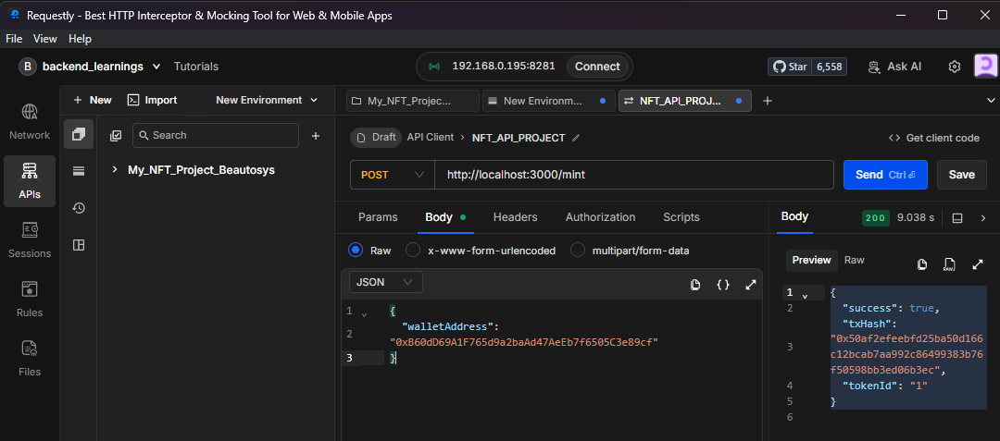

# NFT Minting API (Polygon Amoy Testnet)

## Overview

This project implements a minimal NFT minting system using Solidity, Hardhat, and a Node.js backend. It allows minting ERC-721 NFTs through a backend API that interacts with a deployed smart contract on the Polygon Amoy testnet.

The goal of this project is to demonstrate a complete Web3 workflow including smart contract development, testing, deployment, and backend integration.

---

## Tech Stack

* Solidity (Smart Contract)
* Hardhat (Development & Testing)
* OpenZeppelin Contracts
* Node.js + Express (Backend API)
* ethers.js (Blockchain interaction)
* Polygon Amoy Testnet

---

## Features

### Smart Contract

* ERC-721 NFT implementation
* Fixed maximum supply (5 NFTs)
* Configurable mint price (default: 1 MATIC)
* Base URI support for metadata
* Public mint function
* Owner-only functions:

  * Update mint price
  * Update base URI
  * Withdraw contract balance
* Security:

  * Reentrancy protection
  * Access control using Ownable
  * Payment validation
  * Supply limit enforcement

### Backend API

* POST /mint endpoint
* Accepts wallet address
* Mints NFT via smart contract
* Uses server wallet for signing transactions
* Returns transaction hash and token ID

---

## Project Structure

```
nft-minting-api/
│
├── contracts/          # Smart contract
├── scripts/            # Deployment scripts
├── test/               # Hardhat tests
├── backend/            # Express API
│   ├── server.js
│   └── abi.json
├── .env
├── hardhat.config.js
└── README.md
```

---

## Setup Instructions

### 1. Clone Repository

```
git clone <your-repo-url>
cd nft-minting-api
```

---

### 2. Install Dependencies

```
npm install
```

---

### 3. Environment Variables

Create a `.env` file in root directory:

```
PRIVATE_KEY=your_private_key
RPC_URL=https://rpc-amoy.polygon.technology
CONTRACT_ADDRESS=your_deployed_contract_address
```

Note:

* Do not share your private key
* Ensure wallet has test MATIC

---

## Smart Contract

### Compile

```
npx hardhat compile
```

### Run Tests

```
npx hardhat test
```

Test Coverage Includes:

* Successful mint
* Payment validation
* Max supply enforcement
* Owner-only access control
* Withdraw functionality

---

## Deployment

### Deploy to Amoy Testnet

```
npx hardhat run scripts/deploy.js --network amoy
```

After deployment, copy the contract address and update it in `.env`.

---

## Backend API

### Start Server

```
node backend/server.js
```

Server runs on:

```
http://localhost:3000
```

---

## API Usage

### Mint NFT

**Endpoint:**

```
POST /mint
```

**Request Body:**

```
{
  "walletAddress": "0xYourWalletAddress"
}
```



**Response:**

```
{
  "success": true,
  "txHash": "0x...",
  "tokenId": "1"
}
```

---

## How It Works

1. API receives wallet address
2. Backend fetches mint price from contract
3. Transaction is signed using server wallet
4. Smart contract mint function is executed
5. NFT is minted to provided wallet address
6. API returns transaction hash and token ID

---

## Notes

* Polygon Mumbai testnet is deprecated; Amoy testnet is used instead
* Contract uses base URI for efficient metadata handling
* Gas-efficient design by avoiding per-token URI storage

---

## Future Improvements

* Add API authentication
* Add rate limiting
* Add frontend UI
* Add IPFS integration for metadata

---

## Author

Arpit Singh

Full Stack Blockchain Developer
